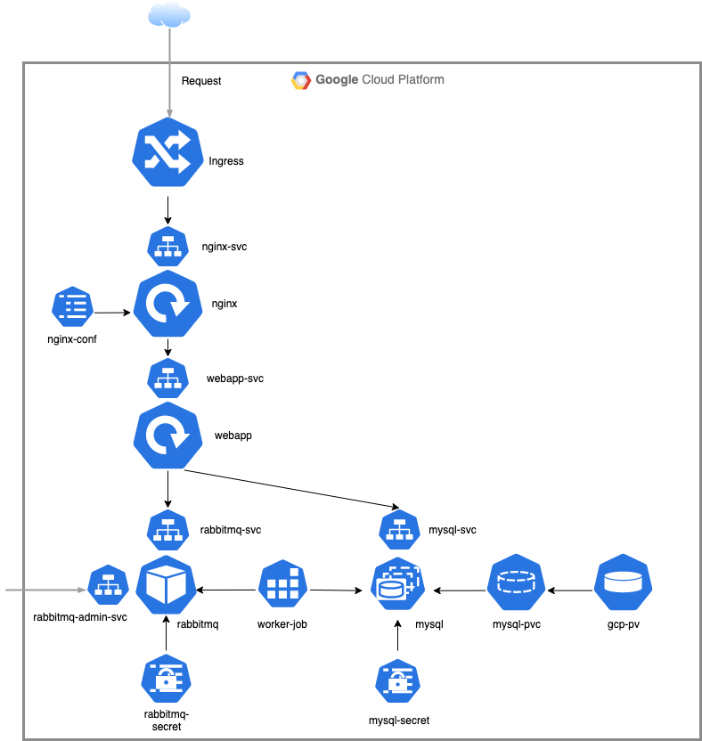

# GKE de Deploy App




1. Setting gcloud configurations

   ```
   gcloud init
   # 自身のGoogleアカウントをCLIへ紐付けする
   # Projectはcommon-proj-290514を選択
   # asia-northeast1-b (東京のゾーンをデフォルトゾーンへ設定)
   ```

2. GKE Clusterを作成

   ```
   #作成済みなので、スキップしてください。
   gcloud container clusters create community-common-cluster --zone asia-northeast1-b --node-locations asia-northeast1-b
   ```

3. GKE Clusterへ接続

   ```
   gcloud container clusters get-credentials community-common-cluster
   
   #確認
   kubectl config view
   kubectl config current-context
   ```

   (推奨)kubectl のaliasの作成

   ```
   alias k='kubectl'
   #kubectlをkと略すことが可能。
   ```

4. Clusterで使用するNameSpaceの設定(個人のリソース棲み分けのため)

   ```
   #NameSpaceの作成
   k create ns (your-namespace)
   
   #デフォルトNameSpaceの設定
   k config set-context $(kubectl config current-context) --namespace=(your-namespace)
   ```

   

5. 動作確認としてGKE ClusterへのnginxのPodを作成してLoadBalancer Serviceによる外部公開

   ```
   #Nginx Podの作成
   kubectl run nginx --image=nginx:alpine --restart=Never
   
   #Service(type:LoadBalancer)の作成
   k expose pod nginx --type=LoadBalancer --port=80 --name=nginx-svc
   
   #Serviceの確認（LBの構築にちょっと時間かかる）
   k get svc
   
   #ExternalIPの取得
   extarnalIp=`k get svc/nginx-svc -o=jsonpath='{.status.loadBalancer.ingress[0].ip}'`
   
   ＃Nginxへのアクセス
   curl $extarnalIp
   
   #nginxのHtmlが応答されればOK
   
   #PodとServiceの削除
   k delete svc nginx-svc
   k delete pod nginx
   ```

   ---

6. GitHubから資材のClone
   ```
   git clone https://github.com/makocchan0509/k8s-handson.git
   ```

7. secretの作成
   ```
   cd ./k8s-handson/secret
   
   #mysqlの接続情報
   k apply -f mysql-secret.yml
   
   #rabbitmqコンソールのアカウント
   k apply -f rabbitmq-secret.yml
   # rabbitmqのコンソールアカウントはadmin/password
   ```

8. Mysqlの作成
   ```
   
   cd ./../db
   
   #PersistentVolumeClaimの作成
   k apply -f mysql-pvc.yml
   
   #StatefulSetでmysqlを作成
   k apply -f mysql-statefulset.yml
   
   #ClusterIP Serviceの作成
   k apply -f mysql-svc.yml
   ```

9. RabbitMQ,Workerの作成

  ```
  cd ./../queue

  #Deploymentの作成
  k apply -f rabbitmq-deploy.yml

  #Queueアクセス用 ClusterIP Serviceの作成
  k apply -f rabbitmq-svc-worker.yml

  #コンソールアクセス用 NodePort Serviceの作成
  k apply -f rabbit-svc-admin.yml

  #GCP上のFirewallにNodePortへのアクセスを許可するように設定追加
  #作成済みなので、スキップしてください。
  gcloud compute firewall-rules create gke-default-nodeport --allow tcp:30798 --source-ranges="0.0.0.0/0" --target-tags=gke-community-common-cluster-e471e6cb-node --description="RabbitMQ Admin Nodeport"

  cd ./../worker

  #Worker Jobの作成
  k apply -f worker-job.yml
  ```

10. Webappの作成

   ```
   cd ./../webapp
     
   #webapp deploymentの作成
   k apply -f webapp.yml
     
   #webapp ClusterIPの作成
   k apply -f webapp-svc.yml	
   ```

11. Nginxの作成

   ```
   cd ./../frontend
     
   #nginx.confをconfigMapへ登録
   k create cm nginx-conf --from-file=nginx.conf
     
   #nginx Deploymentの作成
   k apply -f nginx-deploy.yml
     
   #nginx NodePort Serviceの作成
   k apply -f nginx-svc.yml
   ```

12. Ingressリソースの作成

   ```
   #Ingressリソースの作成
   k apply -f ingress.yml
     
   #結果確認
   k get ing
     
   NAME      HOSTS   ADDRESS         PORTS   AGE
   ingress   *       34.120.75.233   80      12h
     
   #ADDRESSのIPアドレスをメモしてブラウザより以下のURLへアクセス
   http://ADDRESS/question
   ```

13. APのバージョンアップデプロイ

   ```
   #Deploymentに対するイメージの更新
   k set image deploy webapp webapp=asia.gcr.io/common-proj-290514/go-webapp:1.3
     
   #ADDRESSのIPアドレスをメモしてブラウザより以下のURLへアクセス
   http://ADDRESS/question
   ```

14. 更新前のバージョンへロールバック

   ```
   k rollout undo deploy webapp
     
   #ADDRESSのIPアドレスをメモしてブラウザより以下のURLへアクセス
   http://ADDRESS/question
   ```

15. クリーン

   ```
   k -n (your-namespace) delete ing,svc,deploy,sts,cm,secret,pvc --all
   ```
  